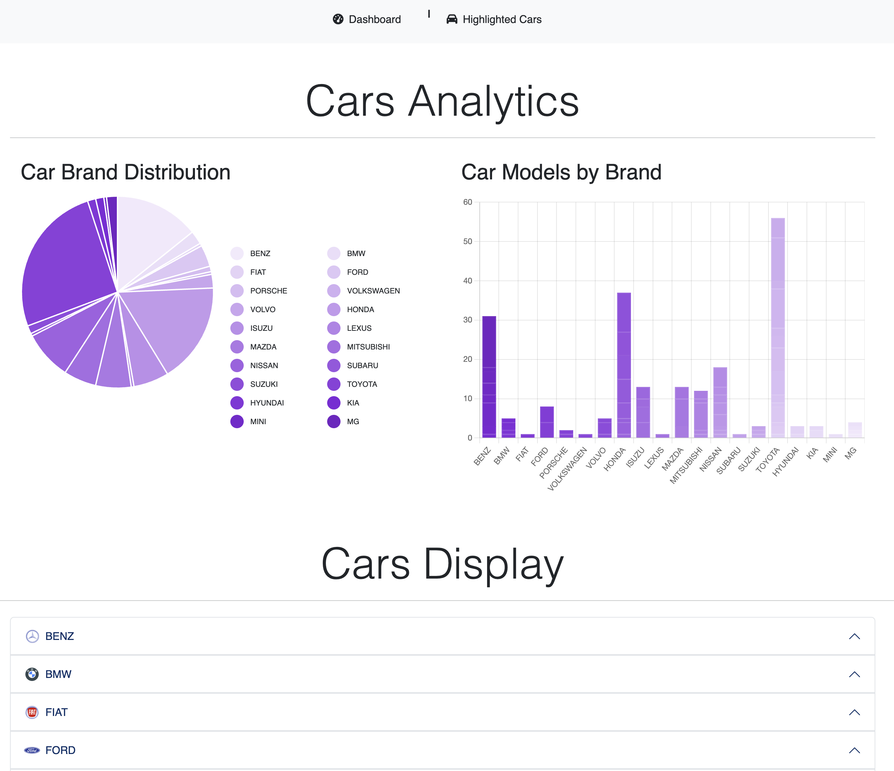
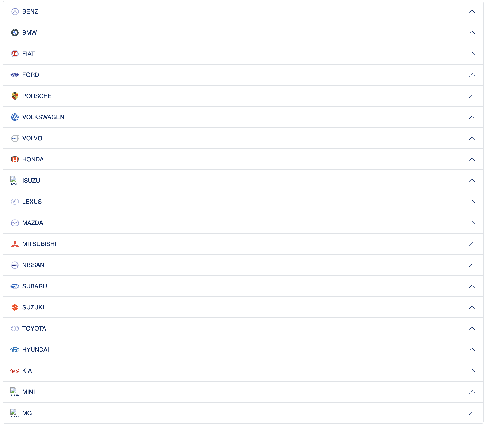
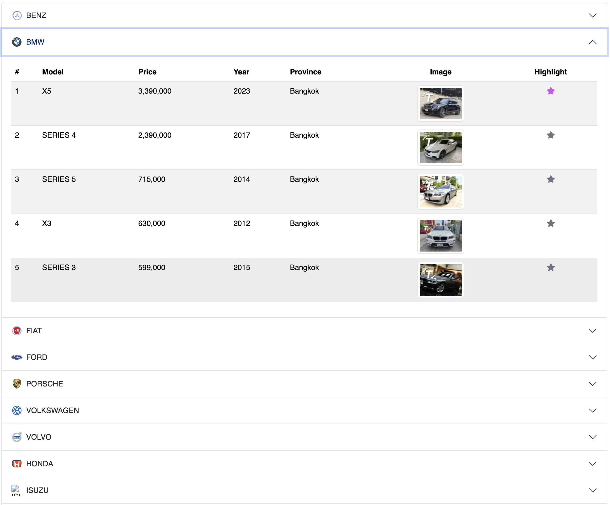
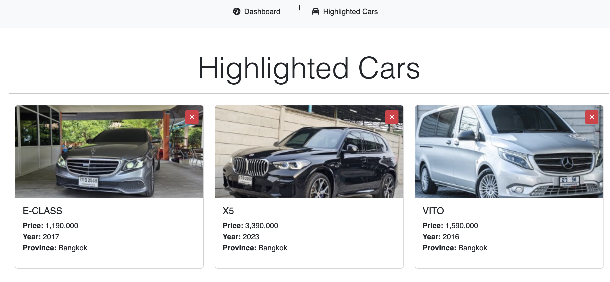

# Car Analytics

## Description

This Car Analytics is a React-based project designed to provide detailed insights into various car brands, models, and their associated data. The website features interactive charts and an intuitive user interface to help users explore and analyze car data effectively.

## Features

- **Dashboard**: Displays a comprehensive overview of car brands and models, including total prices and counts.
- **Brand Details**: View detailed information about specific car models within a selected brand.
- **Highlighting Feature**: Users can highlight their favorite cars, which are then stored in local storage and can be managed on the "Highlighted Cars" page.
- **Interactive Charts**: The website includes a Pie Chart and a Stacked Bar Chart to visualize the distribution of car brands and models.
- **Routing**: Navigation between the dashboard and the highlighted cars page is seamless, thanks to React Router.

## Screenshots

### Dashboard

### Brand Details

### Highlighted Cars

Team Members: 
Name: Lythean Sem, ID: 6511925 
Name: Myat Shoon Lei, ID: 6511333
